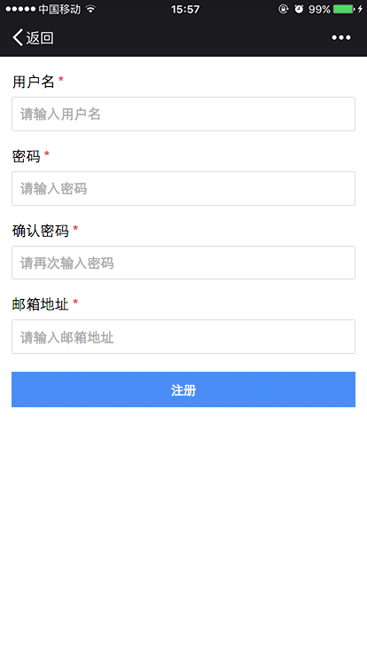

# Form
Aimee的form模块，用于生成表单，表单很多操作都是基于表单控件的name属性，所以确保name属性正确是十分必要的

### Install
```sh
aimee i form
```

### Jade
```jade
.form
    .form-group
        source(name="username")
    .form-group
        source(name="passowrd")
    .form-group
        source(name="telphone")
    .form-group
        source(name="remark")

    .form-ctrl
        button.btn.btn-submit 提交

```

### Example
```javascript
var Form = require('form');
var form = new Form;
var Female = {
    "male": "先生",
    "female": "女士",
    "default": "male"
};

form.load('input').attr({name: 'username'})
form.load('input').attr({name: 'password', type: 'password'})
form.load('input').attr({name: 'telphone', type: 'number', placeholder: '请输入手机号'})
form.load('select').attr({name: "female"}).create(Female).action()
form.load('textarea').attr({name: 'remark'})

// Form控件渲染到.form
form.render($('.form'))

// 获取form数据
$('.form').delegate('.btn-submit', 'click', () => {
    console.log(form.getData())
})
```

### Methods
```js
form.load(id)

@desc 创建表单控件实例
@param {String} id 表单控件id
```

```js
form.reset()

@desc 重置表单
```

```js
form.render(selector)

@desc 为指定的表单渲染表单控件
@param {String | jQuery | Zepto | HTMLNode} selector 表单容器选择器
```

```js
form.setData(data)

@desc 设置表单的数据
@param {Object} data 数据
```

```js
form.getData(full)

@desc 获取表单数据
@param {Boolean} full 是否返回空值，默认为true
```

```js
form.on(type, handler)

@desc 事件监听
@param {String} type 事件类型
@param {Function} handler 回调函数
// 支持 data 事件，当表单控件数据改变时会发射此事件
@example: form.on('data', data => console.log(data))
```

### Preview

